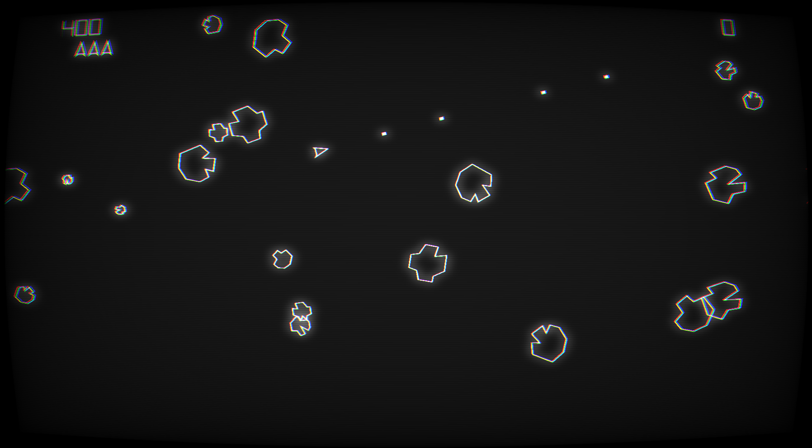
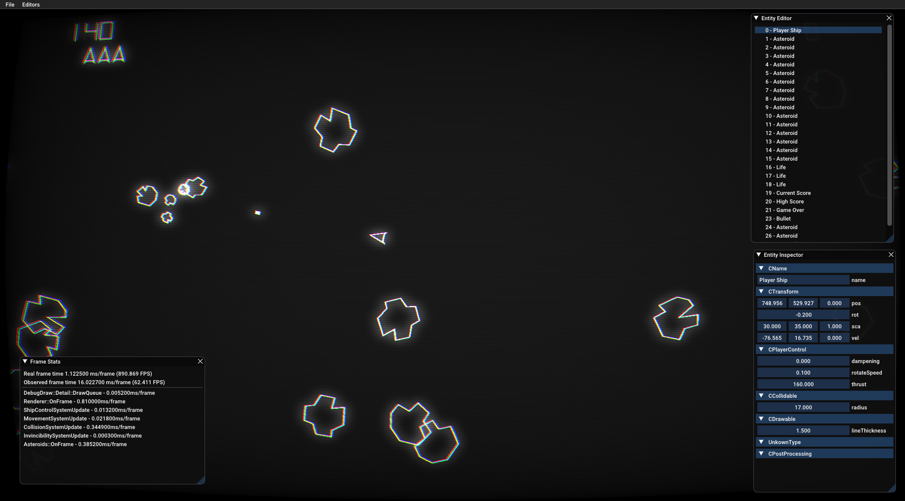

# Athena Toolset

Athena is a small, personal game development toolset built as simply as possible to serve little game experiments I feel like making. The idea is that I make little games and experiments and this drives me to develop various different features that get added to the toolset. I'm making games here, not unecessary game engine features. The first game is an asteroids remake, which looks like this:

The asteroids clone isn't quite finished yet, but so far we have the following features:

- 2D vector like graphics
- Post processing with bloom, chromatic abberation, screen warping and a few other things
- Font drawing
- Simple audio 
- Entity system
- Input
- BONUS: Type reflection (purely because I wanted to make an entity inspector)

# Supported platforms

Currently only Windows 64 bit, as it uses DirectX11. It shouldn't be that hard to port to other platforms though, as the DX11 code all lives in a single file which can be replaced by a OpenGL or Vulkan version. One day I'll get around to this, promise.

# Documentation

Considering it's a really small, fast moving engine, I have decided documentation should live alongside code. Most of the more important systems, like the entity system, have examples and explanation as comments in the code files, and I've tried to comment in as useful a manner as I possible can. 

Explore the code and read the comments. Hopefully if you want to work on this library, learn from it, or use it, it should be relatively straight forward to figure out what's going on.

# Design principles

 - Simpler is generally better, simpler code is easier to change
 - Never add complexity to solve a problem you aren't sure exists
 - Do not attempt to solve all problems
 - Be willing to rewrite systems that aren't solving the problem well enough (this is easier if things are kept simple)
 - Accept that you do not know what the end result will be like
 - When designing systems, it must be considered how they're used before writing them
 - Be explicit. Hiding things is asking for unseen complexity.
 - Design with performance in mind (DOD etc), but allow for fast iterations

 # Compiling

 Before you get to compiling, know that the only external dependency is SDL2. Before you try compiling, make sure SDL development libraries are installed somewhere on your PC.

 Once that's dealt with, it's the usual cmake affair. I like using the cmake gui, but you can use the command line too. Run cmake on the base directory, specifying the "Build" folder as the place to build binaries. It'll ask you for some directories of SDL, and after that generate and build. Currently only tested with VS 2017 Win64. But it should work fine with other generators, so long as it's 64 bit.
